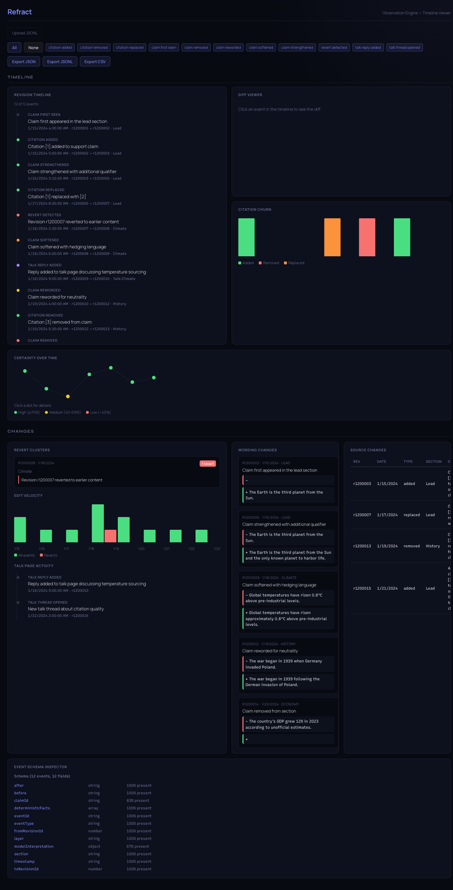

# Refract UI — Visualizer

Standalone web app for exploring Refract observation data. Load any JSONL file of Refract events and see timelines, word-level diffs, citation graphs, and event-type breakdowns. No backend, no server, no data leaves your machine.



## Quick start

```bash
git clone https://github.com/refract-org/refract-ui
cd refract-ui
bun install
bun run dev
```

Open `http://localhost:5173`. Sample data loads immediately. Drag your own `.jsonl` file onto the upload zone to inspect it.

## Generate data to visualize

```bash
refract analyze "Bitcoin" --depth forensic --format ndjson > bitcoin-events.jsonl
```

Use `--depth forensic` for the full 26 event types.

## Panels

### Timeline

Every event in chronological order. Click any event to see the diff. Filter by event type with the tag buttons in the toolbar.

### Diff Viewer

Word-level diff of `before` → `after` for the selected event. Removed text is shown struck-through in red, added text in green.

### Citation Churn

Bar chart of citation additions, removals, and replacements per revision, plus a sortable table of every citation change.

### Certainty Timeline

Confidence scores over time for model-interpreted events. Dots are color-coded: green (≥70%), yellow (40–69%), red (<40%).

### Disputes

Revert clusters, edit velocity per day, and talk page activity timeline.

### Language Changes

Card grid of wording events — claims reworded, strengthened, softened, or removed.

### Schema Inspector

Every JSON key in the loaded data with inferred types and presence percentage.

## Export

Download filtered data as JSON, JSONL, or CSV using the toolbar buttons. Filters apply to exports — narrow by event type first, then export.

## Source

[github.com/refract-org/refract-ui](https://github.com/refract-org/refract-ui) · [Full tutorial](tutorials/refract-ui)
